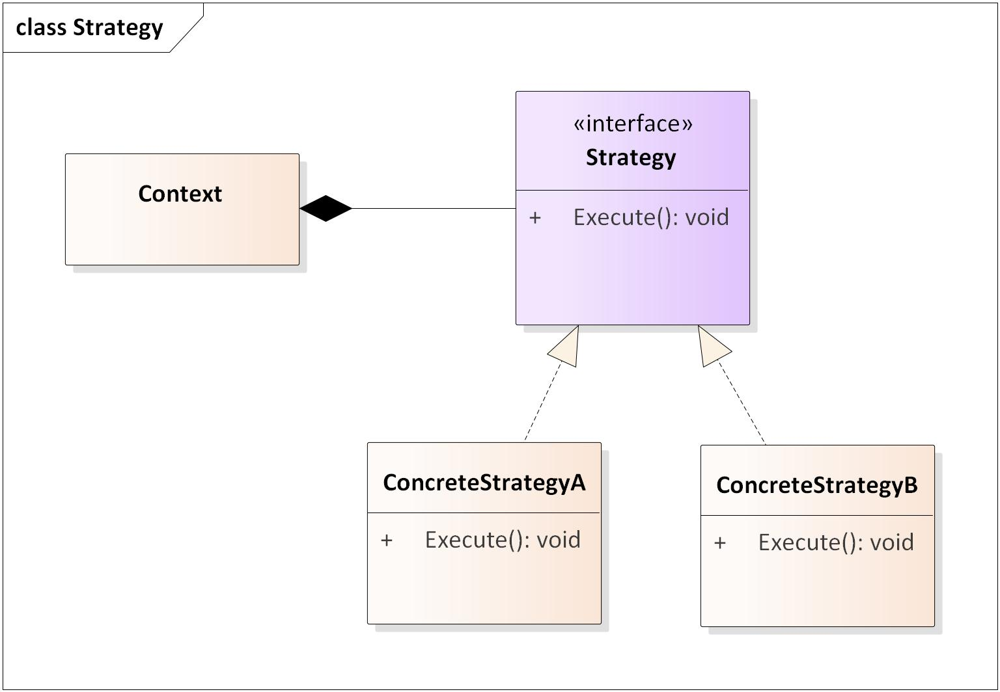

# Strategy Pattern - Sample

This is a sample, in Java, of how to apply the Strategy Pattern in your project.

It was used engine roar and headlights as behaviors that change from car to car.

**Interfaces** (*strategy*)

- EngineRoar (roar)
- HeadLight (turn on and turn off)

**EngineRoar, HeadLight folders** (*Concrete Strategy*)

**Main** (*Context*)

## What is Strategy Pattern

Strategy defines a family of algorithms, encapsulates each of them and makes them interchangeable. It allows the algorithm to vary independently of the clients that use it.

## References

 - [The Strategy Design Pattern](https://medium.com/swlh/the-strategy-design-pattern-85782f1ecc24#:~:text=The%20strategy%20pattern%20is%20a,family%20of%20algorithms%20to%20use.)

